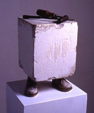
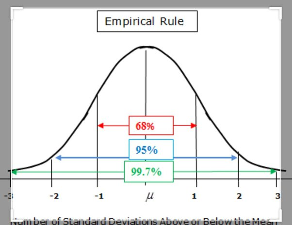

# SE for  Simpler AI: A Minimalist Approach

>  Graduates of this class will become software revolutionaries,
the  CEO and CTOs of whatever follows Google or OpenAI.

TL;DR: 
- To promote efficient and effective problem-solving.
  - Cluster (first), then think (less). 
- Clustering should include dimensionality reduction
  - Ignore the spurious
  - Focus on what's important

 

Here are our themes;

-  **Lo is less, less is more**
  - To go with the flow: go low.
  - Seemingly complex problems can be approximated
  in a very low dimensional space-- where all inference is much  simpler and faster [^lutosa].
  - High-dimensional data can be simplified and understood in lower dimensions.
    - See case studies, below
- **Simplification of AI and SE:** 
  - Be quiet or I will replace you with one very small shell script.
  - Emphasizing the transformation of complex AI concepts into simpler, more understandable forms.
  - Lots of small scripts doing lots of large AI tasks. 
  - Our case study: _semi-supervised explainable AI for multi-objective optimization_ 
  - Our results: tiny scripts with astonishing generality:
    - Not by reusing some large library
    - But by focusing on core processes.
- **Beyond mere programming:**. 
  - Stand out from the crowd.
  - In devops, we automated everything. Here, we automate automation.
  - In the post chatgpt-world, you don't want to be "just" a programmer
  - You want to be the person trading off requirements, telling the programmers what to code (and what not to code).
- **Learning and Skill Development:** 
  - Cut the cr\*p.
  - Focus on enhancing coding skills and theoretical knowledge in AI and software engineering through practical examples.
- **Empowerment through Knowledge:**  
  - More power to you.
  - Motivating readers to become proficient in enhanced coding and analysis, enabling them to tackle complex problems with simplified solutions.
    -  Yes, you (the developer) can understand it.
  - Enabling people, who are not the developers, to understand and critique
  a system and (in an effective manner) demand changes to that system.
    - Yes, you (the community) can critique it and propose improvements to  it.
- **Critical View of Current AI Systems:** 
  - LLMs are great, except when they ain't
  - Analyzing the limitations of current large language models, such as their inefficiency and lack of transparency or validation [^wechat23]
- **Data-Centric Software 2.0:** 
  - Data is the ultimate API
  - Prioritizing a focus on data analysis over algorithmic or code-centric methods.
  -  In Software 2.0 [&se2]  most often the source code comprises
     - the dataset that defines the desirable behavior
     - the architecture that gives the rough skeleton of the code, but with many details
       (the config options) yet to be selected.
     - The process of training learner  compiles the dataset into a model, from which we can
       set the options.
- **Efficiency and Minimalism:** 
  - Advocating for more efficient solutions using fewer resources and simpler methods.
  - Less is more.
  - Less to test, less to deploy, less to maintain, less to check for security flaws, less
    to port to other languages, less to document...
    
- **Importance of 'Pruning' Data:** 
  - The best thing to do with most data is throw it away (and there are many examples of this [^btw] [^stealth] [^early]).
  - Highlighting the need to focus on important data and discard the irrelevant, drawing inspiration from Michelangelo’s sculpting philosophy.
  - "Every block of stone has a statue inside it and it is the task of the sculptor to discover it." -- Michelangelo
- **Practical Problem-Solving Strategy:** 
  - Yes you can.
  - Presenting a practical approach to problem-solving by prioritizing clustering and minimizing assumptions

[^se2]: Andrej Karpathy [Software 2.0](https://karpathy.medium.com/software-2-0-a64152b37c35), 
Medium.com Nov 11, 2027 Karpathy assumes the Software 2.0 learner is a neural  net. I say his point generalizes
to any AI-drive configuration system.

[^wechat23]: For more on this, see T. Menzies. keynote ASE'23, 
 [Beware, some of the rhetoric on LLMs is misleading](http://tiny.cc/we-chat23).

[^btw]: I definitely believe this for classification, regression,
and optimization. Generation, on the other hand, is another matter.

[^stealth]: L. Alvarez and T. Menzies,
["Don’t Lie to Me: Avoiding Malicious Explanations With STEALTH,"](https://arxiv.org/pdf/2301.10407.pdf) in IEEE Software, 
vol. 40, no. 3, pp. 43-53, May-June 2023, doi: 10.1109/MS.2023.3244713.

[^early]: N.C. Shrikanth, Suvodeep Majumder, Tim Menzies  
[Early Life Cycle Software Defect Prediction. Why? How?](https://arxiv.org/pdf/2011.13071.pdf), ICSE'21.

## Case Studies

### \#1: Privacy

What can companies learn from each other (about e.g. defect prediction in code). What can they share
without giving away secrets?

Why share all the data? why not just cluster and just share a few cluster centroids?[^peters]
  - [Fayola Peters](https://www.ezzoterik.com/papers/15lace2.pdf) used cluster + contrast to prune data, as she passed data around a community. 
   - For example, in the following, green rows are those nearest the cluster centroids and blue rows are the ones most associated with the last column (bugs/10Kloc).
   - Discard things are aren't blue of green. 
   - She ended up sharing 20% of the rows and around a third of the columns. 1 - 1/5\*1/3 thus offered 93%   privacy
   - As for the remaining 7% of the data, we ran a mutator that pushed up items up the boundary point between classes (and no further). Bu certain common measures of privacy, that made the 7% space 80% private. 
   - Net effect 93% + .8*7 = 98.4% private,
   - And, FYI, inference on the tiny green+blue region was as effective as inference over all

[^peters]: [Peters, Fayola, Tim Menzies, and Lucas Layman.](https://www.ezzoterik.com/papers/15lace2.pdf)
    2015 IEEE/ACM 37th IEEE International Conference on Software Engineering. Vol. 1. IEEE, 2015.

### Other case studies

Assume the analysis of the last section generalizes. What does that mean for SE:

- Any piece of software can the studied, to find ways to most improve it,
  after trying just a few dozen samples.
  - easier auditing (less to look at)
  - easier explanation (less to look at)
  - easier requirements engineering tool (to encourage a fast discussion across the whole space) [^leit]
  - easier classification for, e.g., predicting Github issue close time;
  - easier testing; e.g. [^ling] [^stall];
  - easier optimization of some goal variables; e.g. [^lutosa];
  - easier  optimization or any task (don't explore the whole space; instead cluster and run your analysis on many small clusters)[^maj18][^riot]
  - easier privacy: we don't have to look/share all the data. Just a tiny sample
    should suffice [^peters].
  - as a runtime checker (cluster the data, then report any new inputs that fall outside the range of the clusters of the test data used to test the system)[^liu]
  - easier project management. Such managers have  many tricks for running a project.
  Any one project uses just a few of those tricks, but which one to apply?
  This method lets you learn what works in your projects.

## Some Theory

High-dimensional data can be approximated in lower dimension
- **Continuity Assumption:**  Points which are closer to each other are more likely to have the same output label.
- **Cluster Assumption:**    Data can be divided into discrete clusters and points in the same cluster are more likely to share an output label.
- **Manifold Assumption:**    high dimensional data can be randomly projected into a lower dimensional  space while controlling the distortion in the pairwise distances. 
  - <a href="https://scikit-learn.org/stable/auto_examples/miscellaneous/plot_johnson_lindenstrauss_bound.html">Examples</a>.
- So we only have to   fit relatively simple, low-dimensional, highly structured subspaces.
- Within a manifolds,  we can  interpolate between two inputs, that is to say, morph one into another via a continuous path along which all points fall on the manifold. 

Why reduce dimensions?

- lower dimensions = less search = easier explanation
- higher dimensionality = more complexity = harder to find releveant examples = less reproduability = less validation = less trust
-  To see this, consider the volume of an $n$-dimensional sphere. 
   -  $V_2( r )={\pi}r^2$ 
   -  $V_3( r )=\frac{4}{3}{\pi}r^3$ 
   - $V_{n>3}( r )= \frac{{2\pi}r^2}{n} V_{n-2}( r )$. 
   -  Now consider the unit sphere i.e. $r=1$   for $n>2\pi$. 
       - Observe how after $n=6$, the volume starts shrinking and hits zero at $n=20$
- So hard to find nearby (relevant) examples
  - Trick: find a transform to map higher to lower.

e.g. (extremely optimistic case) suppose we can _sort_ all the examples along one dimension, 
  - To be $C$ confidence that after $n$ picks, we can find one example,
    is $C(n,p)= 1-(1-p)^n$  
    - Which re-arranges to $n(C,p)=log(1-C)/log(1-p)$
  - Cohen's $d$ tells us that any change smaller than $\sigma/.33$
    is a trivially small change.
    - 99.7% of a normal curve is is covered by  six values: $-3 \le \sigma \le 3$
    - So the  probability of randomly finding  solutions  insignificantly  different to the best solution is:   
    $n(C=.97.5, p=.33/6)\approx 65$
  - Better yet, since the data is sorted,  we can do a binary chop to find this best solution after 
       
    $\log_2(n(C=.975, p=.33/6))\approx 6$ samples.

So via  incredibly optimistic analysis,   when studying
    any number of examples, 6 binary chops should be enough to find 
    solutions statistically indistinguishable from the best solution.
 
In practice, this is too small. But as we shall see, 10-20 samples
takes you a very long way. We will come back to this.

In any case, take that big data!

## References

[^leit]: Veerappa, Varsha, and Emmanuel Letier. 
  ["Understanding clusters of optimal solutions in multi-objective decision problems."](http://www0.cs.ucl.ac.uk/staff/e.letier/publications/2011-clusteringSolutions.pdf)
  2011 IEEE 19Th international requirements engineering conference. IEEE, 2011.

[^ling]: [https://arxiv.org/pdf/2305.03714.pdf](https://arxiv.org/pdf/2305.03714.pdf)

[^liu]: Liu, Z., Qin, T., Guan, X., Jiang, H., & Wang, C. (2018). 
  [An integrated method for anomaly detection from massive system logs](https://ieeexplore.ieee.org/stamp/stamp.jsp?arnumber=8371223)
  IEEE Access, 6, 30602-30611.

[^lutosa]: Andre Lustosa and Tim Menzies. 2023. 
[Learning from Very Little Data: On the Value of Landscape Analysis for Predicting Software Project Health](https://arxiv.org/pdf/2301.06577.pdf). ACM Trans. Softw. Eng. Methodol. Just Accepted (November 2023).

[^maj18]: Suvodeep Majumder, Nikhila Balaji, Katie Brey, Wei Fu, and Tim Menzies. 2018. 
[500+ times faster than deep learning: a case study exploring faster methods for text mining stackoverflow](https://arxiv.org/pdf/1802.05319.pdf). 
In Proceedings of the 15th International Conference on Mining Software Repositories (MSR '18). Association for Computing Machinery, New York, NY, USA, 554–563. https://doi.org/10.1145/3196398.3196424

[^riot]:  Jianfeng Chen, Tim Menzies:
  [RIOT: A Stochastic-Based Method for Workflow Scheduling in the Cloud](https://arxiv.org/pdf/1708.08127.pdf)
  IEEE CLOUD 2018: 318-325

[^stall]: Dimitri Stallenberg, Mitchell Olsthoorn, and Annibale Panichella. 2022. 
 [Improving test case generation for REST APIs through hierarchical clustering] https://chinagator.github.io/papers/J5.pdf)
 In Proceedings of the 36th IEEE/ACM International Conference on Automated Software Engineering (ASE '21). IEEE Press, 117–128. https://doi.org/10.1109/ASE51524.2021.9678586

